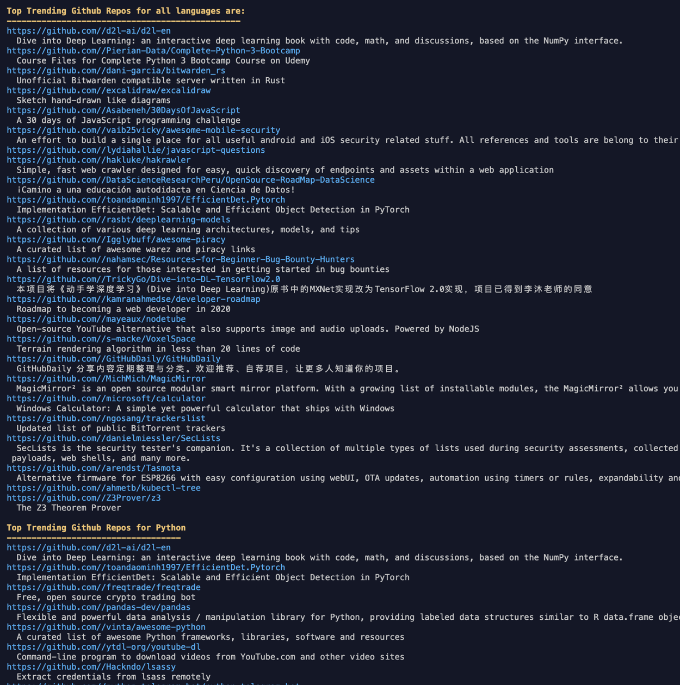

# Rust based Scraper for Trending GitHub repos

Rust based scraper that scrapes the trending Github repos in a terminal. The scraper will display the top repo for all languages, Rust, Python and Go by default.


# Quickstart

- Run using cargo:

```sh
git clone https://github.com/nerdalert/scrape-trending.git
cd scrape-trending
cargo run
```

- or run the mac binary:

```sh
git clone https://github.com/nerdalert/scrape-trending.git
cd scrape-trending
./binaries/x86_64-apple-darwin/scrape-trending
```

If the repo description is empty, it’s probably because it has an emoji in it and those are annoying to scrape and parse.

- Example output:

